# System Architecture

This document provides a comprehensive overview of the EchoStor Security Posture Assessment Tool architecture, including system design, database schema, deployment topology, and security architecture.

## 📋 Table of Contents

- [High-Level Architecture](#high-level-architecture)
- [Frontend Architecture](#frontend-architecture)
- [Backend Architecture](#backend-architecture)
- [Database Schema](#database-schema)
- [Authentication & Security](#authentication--security)
- [Multi-Region Deployment](#multi-region-deployment)
- [Integration Architecture](#integration-architecture)
- [Data Flow](#data-flow)

## 🏗️ High-Level Architecture

```mermaid
graph TB
    User[👤 End Users] --> Frontend[🖥️ Frontend<br/>Next.js on Vercel]
    Admin[👨‍💼 Admins] --> Frontend
    
    Frontend -->|HTTPS API Calls| LB[⚖️ Load Balancer<br/>Fly.io Proxy]
    
    LB --> Backend1[🔧 Backend Instance<br/>IAD Region]
    LB --> Backend2[🔧 Backend Instance<br/>LAX Region] 
    LB --> Backend3[🔧 Backend Instance<br/>SYD Region]
    
    Backend1 --> DB[(🗄️ PostgreSQL<br/>Primary Database)]
    Backend2 --> DB
    Backend3 --> DB
    
    Backend1 -->|AI Report Generation| OpenAI[🤖 OpenAI API<br/>GPT-4]
    Backend2 -->|AI Report Generation| OpenAI
    Backend3 -->|AI Report Generation| OpenAI
    
    Backend1 --> FileStorage[📁 File Storage<br/>PDF Reports]
    Backend2 --> FileStorage
    Backend3 --> FileStorage
    
    subgraph "Fly.io Infrastructure"
        Backend1
        Backend2
        Backend3
        DB
        FileStorage
        LB
    end
    
    subgraph "Vercel Infrastructure"
        Frontend
    end
    
    subgraph "External Services"
        OpenAI
    end
```



## 🖥️ Frontend Architecture

### Technology Stack
- **Framework**: Next.js 14 with App Router
- **Runtime**: React 18 with Concurrent Features
- **Language**: TypeScript for type safety
- **Styling**: Tailwind CSS with responsive design
- **State Management**: React Query for server state + React hooks for local state
- **Forms**: React Hook Form with validation
- **HTTP Client**: Axios with interceptors and retry logic
- **Error Handling**: React Error Boundaries

### Component Architecture

```mermaid
graph TD
    App[_app.tsx<br/>App Shell + Error Boundary] --> Layout[Layout Component<br/>Navigation + Footer]
    
    Layout --> Pages[📄 Pages]
    Layout --> Components[🧩 Components]
    
    Pages --> Auth[🔐 Authentication Pages<br/>login.tsx, register.tsx]
    Pages --> Assessment[📊 Assessment Pages<br/>questions.tsx, dashboard.tsx]
    Pages --> Admin[👨‍💼 Admin Pages<br/>users.tsx, assessments.tsx]
    Pages --> Reports[📄 Reports Pages<br/>index.tsx, download.tsx]
    
    Components --> UI[UI Components<br/>Button, Input, Modal, etc.]
    Components --> Business[Business Components<br/>QuestionCard, ProgressBar]
    Components --> Layout2[Layout Components<br/>Sidebar, Header]
    
    subgraph "State Management"
        ReactQuery[React Query<br/>Server State Cache]
        Hooks[React Hooks<br/>Local State]
    end
    
    subgraph "API Layer"
        APIClient[api.ts<br/>Axios Instance + Interceptors]
        AuthAPI[Auth API Functions]
        AssessmentAPI[Assessment API Functions]
        AdminAPI[Admin API Functions]
    end
    
    Pages --> ReactQuery
    Components --> ReactQuery
    ReactQuery --> APIClient
    APIClient --> AuthAPI
    APIClient --> AssessmentAPI
    APIClient --> AdminAPI
```



### Frontend Data Flow


## 🔧 Backend Architecture

### Technology Stack
- **Framework**: FastAPI with async/await support
- **Language**: Python 3.12 with type hints
- **ORM**: SQLAlchemy 2.0 with async support
- **Migrations**: Alembic for database versioning
- **Authentication**: JWT with passlib/bcrypt
- **Validation**: Pydantic for request/response schemas
- **Background Tasks**: FastAPI BackgroundTasks
- **API Documentation**: OpenAPI/Swagger auto-generation

### Service Architecture

```mermaid
graph TB
    Router[🛣️ API Routers] --> Middleware[⚙️ Middleware Layer]
    Middleware --> Services[🔧 Service Layer]
    Services --> Models[📊 Database Models]
    Services --> External[🌐 External APIs]
    
    subgraph "API Routers"
        AuthRouter[auth.py<br/>Authentication]
        AssessmentRouter[assessment.py<br/>Assessments]
        ReportsRouter[reports.py<br/>Report Generation]
        AdminRouter[admin.py<br/>Admin Functions]
        HealthRouter[health.py<br/>Health Checks]
    end
    
    subgraph "Middleware"
        CORS[CORS Middleware]
        RateLimit[Rate Limiting]
        Auth[JWT Authentication]
        Logging[Request Logging]
    end
    
    subgraph "Services"
        ReportService[report_generator.py<br/>PDF Generation]
        QuestionService[question_parser.py<br/>Assessment Logic]
        AuthService[Auth Service<br/>User Management]
    end
    
    subgraph "Models"
        UserModel[User Model]
        AssessmentModel[Assessment Model]
        ReportModel[Report Model]
        AuditModel[Audit Log Model]
    end
    
    subgraph "External APIs"
        OpenAIAPI[OpenAI API<br/>AI Report Generation]
    end
    
    Router --> AuthRouter
    Router --> AssessmentRouter
    Router --> ReportsRouter
    Router --> AdminRouter
    Router --> HealthRouter
    
    Middleware --> CORS
    Middleware --> RateLimit
    Middleware --> Auth
    Middleware --> Logging
    
    Services --> ReportService
    Services --> QuestionService
    Services --> AuthService
    
    Models --> UserModel
    Models --> AssessmentModel
    Models --> ReportModel
    Models --> AuditModel
    
    External --> OpenAIAPI
```



### Backend Request Flow


## 🗄️ Database Schema

### Entity Relationship Diagram


### Database Indexes

```sql
-- Performance indexes
CREATE INDEX idx_users_email ON users(email);
CREATE INDEX idx_users_created_at ON users(created_at);
CREATE INDEX idx_assessments_user_id ON assessments(user_id);
CREATE INDEX idx_assessments_status ON assessments(status);
CREATE INDEX idx_assessments_created_at ON assessments(created_at);
CREATE INDEX idx_assessment_responses_assessment_id ON assessment_responses(assessment_id);
CREATE INDEX idx_assessment_responses_section_question ON assessment_responses(section_id, question_id);
CREATE INDEX idx_reports_assessment_id ON reports(assessment_id);
CREATE INDEX idx_reports_status ON reports(status);
CREATE INDEX idx_admin_audit_log_timestamp ON admin_audit_log(timestamp);
CREATE INDEX idx_admin_audit_log_admin_email ON admin_audit_log(admin_email);
```

## 🔐 Authentication & Security

### JWT Authentication Flow


### Security Architecture

```mermaid
graph TB
    Internet[🌐 Internet] -->|HTTPS Only| CDN[🛡️ Vercel CDN<br/>Static Assets]
    Internet -->|HTTPS Only| WAF[🛡️ Fly.io Proxy<br/>DDoS Protection]
    
    CDN --> Frontend[🖥️ Frontend App<br/>CSP Headers]
    WAF --> Backend[🔧 Backend API<br/>Rate Limited]
    
    Frontend -->|HTTPS + CORS| Backend
    
    subgraph "Security Layers"
        CSP[Content Security Policy]
        CORS[CORS Protection]
        JWT[JWT Authentication]
        RateLimit[Rate Limiting]
        InputValidation[Input Validation]
        HTTPS[TLS/HTTPS Encryption]
    end
    
    Frontend --> CSP
    Frontend --> CORS
    Backend --> JWT
    Backend --> RateLimit
    Backend --> InputValidation
    Frontend --> HTTPS
    Backend --> HTTPS
    
    Backend --> Database[(🔒 Encrypted Database<br/>PostgreSQL)]
    
    subgraph "Data Protection"
        Encryption[Data at Rest Encryption]
        Backup[Encrypted Backups]
        Audit[Audit Logging]
    end
    
    Database --> Encryption
    Database --> Backup
    Backend --> Audit
```



### Security Features

1. **Transport Security**
   - TLS 1.3 encryption for all connections
   - HTTPS-only with HSTS headers
   - Certificate pinning in production

2. **Authentication & Authorization**
   - JWT tokens with RS256 signing
   - Token expiration and refresh mechanism
   - Role-based access control (user/admin)

3. **Input Security**
   - Pydantic validation for all inputs
   - SQL injection prevention via ORM
   - XSS protection with CSP headers
   - CSRF protection via SameSite cookies

4. **API Security**
   - Rate limiting per endpoint
   - Request size limits
   - CORS policy enforcement
   - API versioning for backward compatibility

5. **Data Security**
   - Password hashing with bcrypt + salt
   - Database encryption at rest
   - Encrypted automated backups
   - PII data anonymization in logs

## 🌍 Multi-Region Deployment

### Deployment Topology

```mermaid
graph TB
    Users[👥 Global Users] --> DNS[🌐 Fly.io Anycast DNS]
    
    DNS --> IAD[🏢 US East (IAD)<br/>Primary Region]
    DNS --> LAX[🏢 US West (LAX)<br/>Secondary Region]
    DNS --> SYD[🏢 Australia (SYD)<br/>Admin Access]
    
    subgraph "US East (IAD) - Primary"
        IAD_APP[FastAPI Instance]
        IAD_DB[(Primary Database<br/>Read/Write)]
        IAD_FILES[File Storage<br/>Reports]
    end
    
    subgraph "US West (LAX) - Secondary"
        LAX_APP[FastAPI Instance]
        LAX_DB[(Read Replica<br/>Read Only)]
    end
    
    subgraph "Australia (SYD) - Admin"
        SYD_APP[FastAPI Instance<br/>Admin Access]
        SYD_DB[(Read Replica<br/>Read Only)]
    end
    
    IAD_APP --> IAD_DB
    IAD_APP --> IAD_FILES
    LAX_APP --> LAX_DB
    SYD_APP --> SYD_DB
    
    IAD_DB -.->|Streaming Replication| LAX_DB
    IAD_DB -.->|Streaming Replication| SYD_DB
    
    subgraph "Frontend (Global)"
        Vercel[Vercel CDN<br/>Global Edge Network]
    end
    
    Users --> Vercel
    Vercel -->|API Calls| DNS
```

### Regional Configuration

| Region | Code | Purpose | Database | File Storage |
|--------|------|---------|----------|--------------|
| US East | IAD | Primary production | Read/Write | Primary storage |
| US West | LAX | Secondary production | Read replica | Shared storage |
| Australia | SYD | Admin access | Read replica | Shared storage |

### Traffic Routing

1. **User Requests**: Routed to nearest region (IAD/LAX for users)
2. **Admin Requests**: Routed to SYD for admin users (based on JWT claims)
3. **Database Writes**: Always routed to primary (IAD)
4. **File Downloads**: Served from primary region with CDN caching

## 🔄 Integration Architecture

### External Service Integration

```mermaid
graph LR
    Backend[🔧 Backend Services] --> OpenAI[🤖 OpenAI API<br/>GPT-4 Turbo]
    Backend --> Email[📧 Email Service<br/>SendGrid/SES]
    Backend --> Storage[📁 Object Storage<br/>Fly.io Volumes]
    Backend --> Monitoring[📊 Monitoring<br/>Fly.io Metrics]
    
    Frontend[🖥️ Frontend] --> Analytics[📈 Analytics<br/>Vercel Analytics]
    Frontend --> CDN[🌐 CDN<br/>Vercel Edge Network]
    
    subgraph "Third-party APIs"
        OpenAI
        Email
        Analytics
    end
    
    subgraph "Infrastructure"
        Storage
        Monitoring
        CDN
    end
```



### API Integration Patterns

1. **Circuit Breaker Pattern**: For OpenAI API calls
2. **Retry with Exponential Backoff**: For transient failures
3. **Request Deduplication**: Prevention of duplicate API calls
4. **Rate Limit Handling**: Respect third-party API limits
5. **Fallback Mechanisms**: Graceful degradation when services unavailable

## 📊 Data Flow

### Assessment Flow


### Report Generation Flow


## 🚀 Performance Architecture

### Caching Strategy

```mermaid
graph TB
    Client[👤 Client] --> EdgeCache[🌐 Vercel Edge Cache<br/>Static Assets]
    Client --> AppCache[📱 Browser Cache<br/>API Responses]
    
    EdgeCache --> Frontend[🖥️ Frontend App]
    AppCache --> ReactQuery[⚡ React Query Cache<br/>Server State]
    
    Frontend --> Backend[🔧 Backend API]
    ReactQuery --> Backend
    
    Backend --> DBConnPool[🏊 Connection Pool<br/>PostgreSQL]
    Backend --> QueryCache[💾 Query Cache<br/>Expensive Queries]
    
    DBConnPool --> Database[(🗄️ Primary Database)]
    QueryCache --> Database
    
    subgraph "Cache Layers"
        EdgeCache
        AppCache
        ReactQuery
        QueryCache
    end
    
    subgraph "Cache TTL"
        Static[Static Assets: 1 year]
        API[API Responses: 5 minutes]
        Queries[Database Queries: 1 minute]
    end
```



### Performance Optimizations

1. **Frontend Performance**
   - Code splitting with Next.js dynamic imports
   - Image optimization with Next.js Image component
   - Progressive loading for assessment questions
   - React Query for efficient data fetching

2. **Backend Performance**
   - Async/await for non-blocking I/O
   - Database connection pooling
   - Query optimization with proper indexes
   - Background task processing

3. **Database Performance**
   - Strategic indexing on frequently queried columns
   - Query optimization and EXPLAIN analysis
   - Connection pooling with SQLAlchemy
   - Read replicas for scaling read operations

---

This architecture document provides a comprehensive overview of the system design. For implementation details, see:
- [API Documentation](API.md)
- [Deployment Guide](DEPLOYMENT.md)
- [Contributing Guidelines](../CONTRIBUTING.md)
